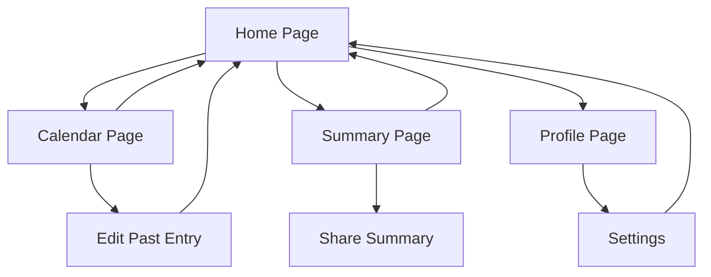

# Three Sentences a Day - Product Requirements Document

## 1. Product Overview
A minimalist mobile journaling app that allows users to input three sentences per day, reducing the burden of traditional journaling while helping users visualize emotional patterns and maintain consistency through light structure and aesthetic UI.

The app targets students and young professionals who are emotionally thoughtful but time-strapped, seeking mental clarity and light structure in their daily lives. The product aims to create a fast "open → write → close" experience with motivational feedback.

## 2. Core Features

### 2.1 Feature Module
Our Three Sentences a Day app consists of the following main pages:
1. **Home page**: daily motivation quote, three sentence input fields, save functionality, recent entries preview.
2. **Calendar page**: monthly calendar view, entry status indicators, date navigation, completion statistics.
3. **Summary page**: weekly AI-generated summaries, mood analysis, sharing functionality, personal insights.
4. **Profile page**: user statistics, achievement system, settings, data management.

### 2.2 Page Details

| Page Name | Module Name | Feature description |
|-----------|-------------|---------------------|
| Home page | Daily Quote Banner | Display motivational quote with emoji, auto-refresh daily |
| Home page | Three Sentence Input | Three separate text fields with character limits (0/40), placeholder prompts |
| Home page | Date Header | Show current date, allow navigation to previous days |
| Home page | Save Button | Save entries to local storage, show confirmation feedback |
| Home page | Recent Entries | Display recent journal entries with dates |
| Calendar page | Monthly Calendar | Full month view with date navigation, highlight entry completion |
| Calendar page | Entry Indicators | Visual markers for completed days, completion percentage |
| Calendar page | Date Selection | Tap to view/edit specific day entries |
| Calendar page | Statistics Summary | Show monthly completion rate and streak count |
| Summary page | Weekly Summary | AI-generated reflection based on week's entries |
| Summary page | Mood Analysis | Emotional pattern visualization with percentages |
| Summary page | Share Function | Export weekly summary for sharing |
| Summary page | Navigation Controls | Browse different weeks with date range display |
| Profile page | User Statistics | Total days, total sentences, streak records, monthly progress |
| Profile page | Achievement System | Badges for milestones (7 days, 30 days, etc.) |
| Profile page | Settings Panel | Daily reminders toggle, theme settings, data backup |
| Profile page | Data Management | Export data, backup options |

## 3. Core Process

**Daily Journaling Flow:**
Users open the app to see today's motivational quote, fill in three sentence fields with guided prompts, save their entries, and receive confirmation feedback.

**Calendar Review Flow:**
Users navigate to calendar view to see their monthly progress, tap on specific dates to review or edit past entries, and track their completion statistics.

**Weekly Reflection Flow:**
Users access the summary page to view AI-generated weekly insights, analyze their mood patterns, and optionally share their progress.

## 4. User Interface Design

### 4.1 Design Style
- **Primary colors**: Warm orange (#FFA726) for highlights and buttons, soft yellow (#FFF3C4) for backgrounds
- **Secondary colors**: Light gray (#F5F5F5) for cards, dark gray (#424242) for text
- **Button style**: Rounded corners with subtle shadows, orange gradient for primary actions
- **Font**: Clean sans-serif, 16px for body text, 14px for secondary text, 18px for headers
- **Layout style**: Card-based design with generous white space, bottom navigation bar
- **Icons**: Minimalist line icons with emoji accents for emotional warmth

### 4.2 Page Design Overview

| Page Name | Module Name | UI Elements |
|-----------|-------------|-------------|
| Home page | Daily Quote Banner | Orange gradient background, centered white text, emoji accent |
| Home page | Three Sentence Input | Orange-bordered text fields, character counters, placeholder text |
| Home page | Save Button | Full-width orange button with rounded corners, white text |
| Calendar page | Monthly Calendar | Grid layout, orange highlights for completed days, navigation arrows |
| Calendar page | Statistics | Card-based layout with completion percentages and streak counters |
| Summary page | Weekly Summary | Card design with AI icon, expandable content, share button |
| Summary page | Mood Analysis | Horizontal progress bars with color coding, percentage labels |
| Profile page | User Stats | Number cards with icons, achievement badges, settings list |

### 4.3 Responsiveness
The app is designed mobile-first with touch-optimized interactions. All buttons and interactive elements have minimum 44px touch targets, and the interface adapts to different screen sizes while maintaining the card-based layout structure.